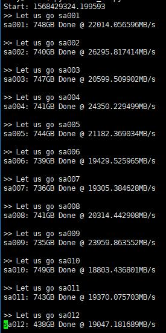

# AutoRclone: rclone copy/move/sync (automatically) with service accounts (still in the beta stage)
Many thanks for [rclone](https://rclone.org/), [folderclone](https://github.com/Spazzlo/folderclone), [AutoRclone](https://github.com/xyou365/AutoRclone), [create-service-accounts](https://github.com/akshzyx/create-service-accounts)

- [x] create service accounts using script
- [x] add massive service accounts into rclone config file
- [x] add massive service accounts into groups for your organization
- [x] automatically switch accounts when rclone copy/move/sync 
- [x] Windows system is supported

Step 1. Copy code to your VPS or local machine
---------------------------------
_Before everything, install python3. Because we use python as our programing language._

<!-- **For Linux system**: Install
[screen](https://www.interserver.net/tips/kb/using-screen-to-attach-and-detach-console-sessions/),
`git` 
and [latest rclone](https://rclone.org/downloads/#script-download-and-install). 
If in Debian/Ubuntu, directly use this command
```
sudo apt-get install screen git && curl https://rclone.org/install.sh | sudo bash
```
After all dependency above are successfully installed, run this command
```
sudo git clone https://github.com/xyou365/AutoRclone && cd AutoRclone && sudo pip3 install -r requirements.txt
```
**For Windows system**: Directly download this project then [install latest rclone](https://rclone.org/downloads/). 
Then run this command (type in cmd command windows or PowerShell windows) in our project folder
```
pip3 install -r requirements.txt
``` -->
**For Linux system**: Run this command
```
sudo git clone https://github.com/thoaidt/AutoRclone-NewMethod && cd AutoRclone-NewMethod && sudo pip3 install -r requirements.txt
```
**For Windows system**: Run this command (type in cmd command windows or PowerShell windows) in our project folder
```
pip3 install -r requirements.txt
```

Step 2. Generate service accounts [What is service account](https://cloud.google.com/iam/docs/service-accounts) [How to use service account in rclone](https://rclone.org/drive/#service-account-support).
---------------------------------
Let us create only the service accounts that we need. 
**Warning:** abuse of this feature is not the aim of autorclone and we do **NOT** recommend that you make a lot of projects, just one project and 100 sa allow you plenty of use, its also possible that overabuse might get your projects banned by google. 


<!-- Enable the Drive API in [Python Quickstart](https://developers.google.com/drive/api/v3/quickstart/python)
and save the file `credentials.json` into project directory.

If you do not have any project in your account then 
* create 1 projec
* enable the required services
* create 100 (1 project, each with 100) Service Accounts
* and download their credentials into a folder named `accounts`

```
Note: 1 service account can copy around 750gb a day, 1 project makes 100 service accounts so thats 75tb a day, for most users this should easily suffice. 
```

The command would look something like 
 `python3 gen_sa_accounts.py --quick-setup 1`
 replace "1" with the number of projects you want

If you have already N projects and want to create service accounts only in newly created projects,

to 
* create additional 1 project (project N+1 to project N+2)
* enable the required services
* create 100 (1 project, with 100) Service Accounts
* and download their credentials into a folder named `accounts`
 
run 

`python3 gen_sa_accounts.py --quick-setup 1 --new-only` 

If you want to create some service accounts using existing projects (do not create more projects), run 
`python3 gen_sa_accounts.py --quick-setup -1`.
Note that this will overwrite the existing service accounts.

After it is finished, there will be many json files in one folder named `accounts`.  -->


**Create credentials.json in Google Cloud Console**

- Go to the [Google Cloud Console](https://console.cloud.google.com/) and if you don't have an existing project, create a new one
- Go to the [OAuth Consent Screen](https://console.cloud.google.com/apis/credentials/consent) and select "External" and click on "Create"
- Fulfill all required informations (the one with a red *) and click on "Save and Continue" 3 times (the "Scopes" and "Test users" parts do not require any inputs)
- Click on publish app and confirm
- On the [credentials](https://console.cloud.google.com/apis/credentials) tab, click on "Create Credentials" then "OAuth client ID"
- Select "Desktop app" & assign any name and proceed
- Click on the download button on the right of your OAuth Client IDs and save the file with the following name :  `credentials.json` in the "create-service-accounts" folder


**ENABLE Required API**

  - Go to [console.cloud.google.com/apis/library](https://console.cloud.google.com/apis/library)

  - ENABLE Google Drive API

  - ENABLE Identity and Access Management (IAM) API
  

**Create Token.Pickle + Token_sa.Pickle + Service Accounts JSON Files from Windows CMD**

***Generate Token.pickle***

- Now run either of the command
 
  - `python3 create-service-accounts/generate_drive_token.py`

  or
    
    - `python create-service-accounts/generate_drive_token.py`

 - Now copy paste the URL in browser for authentication

Now you would see **Token.pickle** saved in your folder


***Generate Token_sa.pickle + SA Accounts folder***


<!-- - Run the following command
  - `python -m pip install progress` -->


- Now run either of the command
 
  - `python3 create-service-accounts/gen_sa_accounts.py --quick-setup 1 --new-only`

  or
    
    - `python create-service-accounts/gen_sa_accounts.py --quick-setup 1 --new-only`

 - Now copy paste the URL in browser for authentication

Now you would see **SAs (service accounts) folder and token_sa.pickle** saved in your folder


Step 3. Add service accounts to Google Groups (Optional but recommended for hassle free long term use)
---------------------------------
We use Google Groups to manager our service accounts considering the  
[Official limits to the members of Team Drive](https://support.google.com/a/answer/7338880?hl=en) (Limit for individuals and groups directly added as members: 600).

#### For GSuite Admin
1. Turn on the Directory API following [official steps](https://developers.google.com/admin-sdk/directory/v1/quickstart/python) (save the generated json file to folder `credentials`).

2. Create group for your organization [in the Admin console](https://support.google.com/a/answer/33343?hl=en). After create a group, you will have an address for example`sa@yourdomain.com`.

3. Run `python3 add_to_google_group.py -g sa@yourdomain.com`

_For meaning of above flags, please run `python3 add_to_google_group.py -h`_

#### For normal user

Create [Google Group](https://groups.google.com/) then add the service accounts as members by hand.
Limit is 10 at a time, 100 a day but if you read our warning and notes above, you would have 1 project and hence easily in your range. 

Step 4. Add service accounts or Google Groups into Team Drive
---------------------------------
_If you do not use Team Drive, just skip._
**Warning:** It is **NOT** recommended to use service accounts to clone "to" folders that are not in teamdrives, SA work best for teamdrives. 

If you have already created Google Groups (**Step 2**) to manager your service accounts, add the group address `sa@yourdomain.com` or `sa@googlegroups.com` to your source Team Drive (tdsrc) and destination Team Drive (tddst). 
 
Add service accounts directly into Team Drive.
> - Add service accounts into your source Team Drive:
`python3 create-service-accounts/add_to_team_drive.py -d SharedTeamDriveSrcID`
> - Add service accounts into your destination Team Drive:
`python3 create-service-accounts/add_to_team_drive.py -d SharedTeamDriveDstID`

Step 5. Start your task
---------------------------------
Let us copy hundreds of TB resource using service accounts. 
**Note**: Sarcasm, over abuse of this (regardless of what cloning script you use) may get you noticed by google, we recommend you dont be a glutton and clone what is important instead of downloading entire wikipedia.

#### For server side copy
- [x] publicly shared folder to Team Drive
- [x] Team Drive to Team Drive
- [ ] publicly shared folder to publicly shared folder (with write privilege)
- [ ] Team Drive to publicly shared folder
```
python3 rclone_sa_magic.py -s SourceID -d DestinationID -dp DestinationPathName -b 1 -e 600
```
- _For meaning of above flags, please run python3 rclone_sa_magic.py -h_

- _Add `--disable_list_r` if `rclone` [cannot read all contents of public shared folder](https://forum.rclone.org/t/rclone-cannot-see-all-files-folder-in-public-shared-folder/12351)._

- _Please make sure the Rclone can read your source and destination directory. Check it using `rclone size`:_

1. ```rclone --config rclone.conf size --disable ListR src001:```

2. ```rclone --config rclone.conf size --disable ListR dst001:```

#### For local to Google Drive (needs some testing)
- [x] local to Team Drive
- [ ] local to private folder
- [ ] private folder to any (think service accounts cannot do anything about private folder)
```
python3 rclone_sa_magic.py -sp YourLocalPath -d DestinationID -dp DestinationPathName -b 1 -e 600
```

* Run command `tail -f log_rclone.txt` to see what happens in details (linux only).

 


